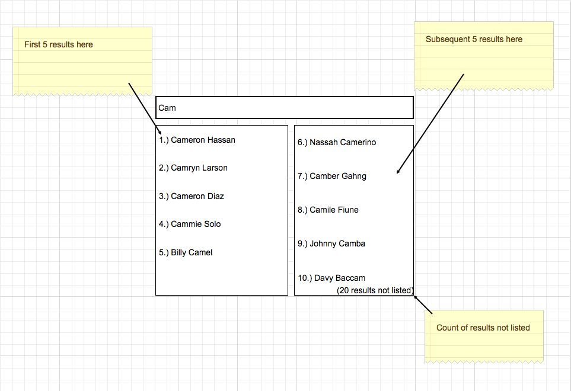

# Angular Interview Project

## Setup
1. Verify rails is installed - `ruby -v`
2. Verify sqlite is installed - `$ sqlite3 --version`
3. Clone Repository - `git clone github.com/clutter/clutter-ng-interview.git`
4. cd into repo - `cd clutter-ng-interview`
5. (in repo) install rails dependencies - `bundle install`
6. (in repo) install JS dependencies - `npm install`
7. (in repo) set up db - `rake db:migrate`
8. (in repo) fill local db - `rake db:seed`

That should get you up and running, to run your local server run `rails s` in your terminal, with default settings that will let you access your app at `localhost:3000`

To run your karma tests once you can run `rake karma:run`

If you want the tests to rerun when you save the file you can run `rake karma:start` in a separate terminal.

## Task
Implement a search service in JavaScript that searches through an array of names _(retrieved from the persons endpoint)_ and returns a list of matching results.

For example, searching for ‘John’ should return all array elements with the first name of John or the last name of John, if any. Searching for ‘John Smith’ should return all John Smiths found in the array.

A user interface such as an input field to type in the search query should be included as well. **See the included mockup** for a sample of what the final result should look like.

**The search should:**
  * be an unanchored substring search
  * be case insensitive
  * return no results with no query
  * **EXTRA CREDIT:** Bold the substring match

#### Task Notes
* This app has been scaffolded out, please write your solution code in the `persons_controller.js`, `persons_resource.js`, `persons_controller_spec.js` and `home/index.html.erb` files

* In the seed data provided there is a one table `Person` with the columns `name` and `id`, you can get a JSON array of all the rows in the Persons table by hitting the endpoint `/persons.json`

* Our app uses NgResource to handle async requests from the api endpoints. Please use this method to request the data from the `Person` table. - `https://docs.angularjs.org/api/ngResource/service/$resource`

## Mock up

